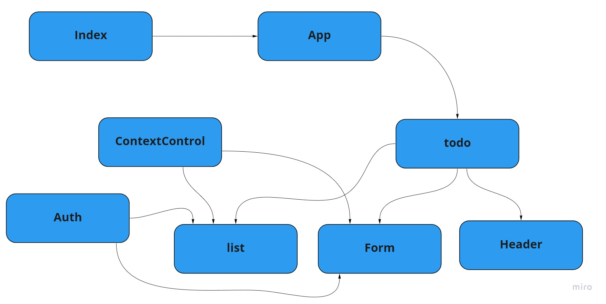

 # UML

# Netlify

[Netlify](https://62906b24bb92f15b1348ce13--superb-stardust-69a7e9.netlify.app/)

How the global state is consumed by the components

1-  creat a settings context, using react.createContext()
2- create the settings provider function and add all the setting sates in there using the useState() hook
3- put all the states and their setters in a state object so we can call each of them by name
4-return using the settings context provider and pass the state object to it as value props 
in the main component we will call the settings provider function and wrap it around all the components that we want to consume the global state

The operation of the hook useForm()
useForm() is a costum hook the has handling functions, the hook takes a callback function as an argument, it will make sure the other operations run befor that callback function is called, like to handle events before passing the value, or to add new values before passing them to the function.